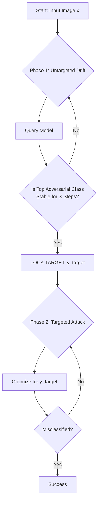

# Opportunistic-Adversarial-Attacks

**A Hybrid Query-Optimization Framework for Black-Box Adversarial Attacks**

## Research Abstract

Standard black-box attacks (like SimBA and Square Attack) often suffer from inefficient "random walks" in the latent space during untargeted attacks, or require difficult a priori knowledge for targeted attacks.

**Opportunistic Targeting** is a novel strategy designed to bridge this gap. It operates on a **Rank-Stability Heuristic**:
1.  **Exploration:** The attack initiates in untargeted mode, allowing the adversarial example to naturally drift along the path of least resistance.
2.  **Identification:** A stability buffer monitors the top non-ground-truth logits. If a specific class maintains the highest rank for $X$ consecutive iterations (the "Stability Threshold"), it is flagged as the optimal exit point.
3.  **Exploitation:** The algorithm dynamically locks onto this class and switches to a pure Targeted Attack mode to aggressively breach the decision boundary.

This repository validates this logic on two attack vectors: **SimBA** (Simple Black-box Adversarial Attacks) and **Square Attack** (with cross-entropy loss). The CE-loss ablation on Square Attack isolates the framework's contribution — opportunistic targeting compensates for the latent-space drift inherent in losses that lack intrinsic directionality (see `SQUARE_ATTACK.md`).

---

## Key Features

* **Dynamic Mode Switching:** Automated transition from Untargeted Exploration to Targeted Exploitation.
* **Rank-Stability "Debouncing":** Prevents locking onto volatile classes that spike due to random noise, ensuring resources are only committed to the most viable target.
* **Query Efficiency:** Designed to minimize the query count ($Q$) required to fool the network compared to standard untargeted baselines.
* **SimBA Integration:** Fully functional implementation of Opportunistic Targeting applied to the SimBA algorithm.
* **Square Attack Validation:** CE-loss ablation on Square Attack confirms the framework restores ~97% of oracle-targeted efficiency for drift-prone losses (see `SQUARE_ATTACK.md`).

---

## Logic Visualization

The core innovation is the **Stability Check** loop.


---

## Quick Start

1.  **Install dependencies**
    ```bash
    pip install -r requirements.txt
    ```

2.  **Launch the demonstrator**
    ```bash
    python launch_demo.py
    ```

3.  **Access the interface**
    Open [http://127.0.0.1:7860](http://127.0.0.1:7860) in your browser.
