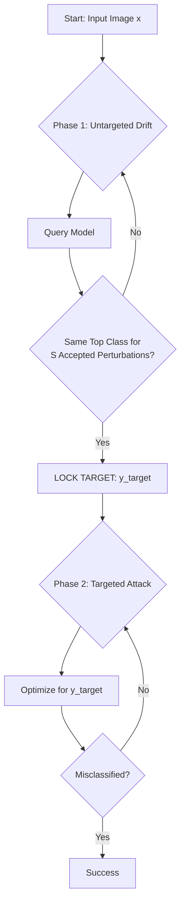

# Opportunistic-Adversarial-Attacks

**A Hybrid Query-Optimization Framework for Black-Box Adversarial Attacks**

## Research Abstract

Standard black-box attacks (like SimBA) often suffer from inefficient "random walks" in the latent space during untargeted attacks. While state-of-the-art methods like Square Attack mitigate this via margin loss, this inefficiency re-emerges when attacks are constrained to Cross-Entropy loss or lack intrinsic directional optimization.

**Opportunistic Targeting** is a novel strategy designed to bridge this gap. It operates on a **Rank-Stability Heuristic**:
1.  **Exploration:** The attack initiates in untargeted mode, allowing the adversarial example to naturally drift along the path of least resistance.
2.  **Identification:** A stability buffer monitors the top non-ground-truth logits. If a specific class maintains the highest rank for $X$ consecutive iterations (the "Stability Threshold"), it is flagged as the optimal exit point.
3.  **Exploitation:** The algorithm dynamically locks onto this class and switches to a pure Targeted Attack mode to aggressively breach the decision boundary.

This repository validates this logic on two attack vectors: **SimBA** (Simple Black-box Adversarial Attacks) and **Square Attack** (with cross-entropy loss). The CE-loss ablation on Square Attack isolates the framework's contribution — opportunistic targeting compensates for the latent-space drift inherent in losses that lack intrinsic directionality (see `SQUARE_ATTACK.md`).

---

## Key Features

* **Dynamic Mode Switching:** Automated transition from Untargeted Exploration to Targeted Exploitation.
* **Rank-Stability "Debouncing":** Prevents locking onto volatile classes that spike due to random noise, ensuring resources are only committed to the most viable target.
* **Query Efficiency:** Designed to minimize the query count ($Q$) required to fool the network compared to standard untargeted baselines.
* **SimBA Integration:** Fully functional implementation of Opportunistic Targeting applied to the SimBA algorithm.
* **Square Attack Validation:** CE-loss ablation on Square Attack confirms the framework restores near-oracle efficiency for drift-prone losses (see `SQUARE_ATTACK.md` and `results/benchmark_standard_summary.csv`).

---

## Logic Visualization

The core innovation is the **Stability Check** loop.



*S = `stability_threshold` (default 5 for standard models, 10 is safer especially for robust models that are very noisy at the beginning of the untargeted drift). An "accepted perturbation" is a step that improved the adversarial loss — not every query counts toward S.*

---

## Quick Start

1.  **Install dependencies**

    **With GPU (NVIDIA CUDA 12.1):**
    ```bash
    pip install -r requirements-gpu.txt
    ```

    **CPU only:**
    ```bash
    pip install -r requirements-cpu.txt
    ```

2.  **Launch the demonstrator**
    ```bash
    python launch_demo.py
    ```

3.  **Access the interface**
    Open [http://127.0.0.1:7860](http://127.0.0.1:7860) in your browser.

---

## Benchmark Results

See [`STANDARD_NN_BENCHMARK.md`](STANDARD_NN_BENCHMARK.md) for the full analysis with figures. Key findings on standard (non-robust) ImageNet classifiers:

* **48% fewer queries** for Square Attack (CE loss) with opportunistic targeting vs. untargeted baseline, and **14% fewer** for SimBA — while matching 100% oracle-targeted success rates.
* **Benefits scale with model depth:** ResNet-50 sees the largest gains (up to 64% for Square Attack), supporting a depth-dependent drift hypothesis.
* **OT rescues failures:** SimBA's untargeted success rate jumps from 88% to 100% with opportunistic targeting, converting budget-exceeded runs into successes.

To regenerate figures from benchmark CSVs:
```bash
python analyze_benchmark.py
```
