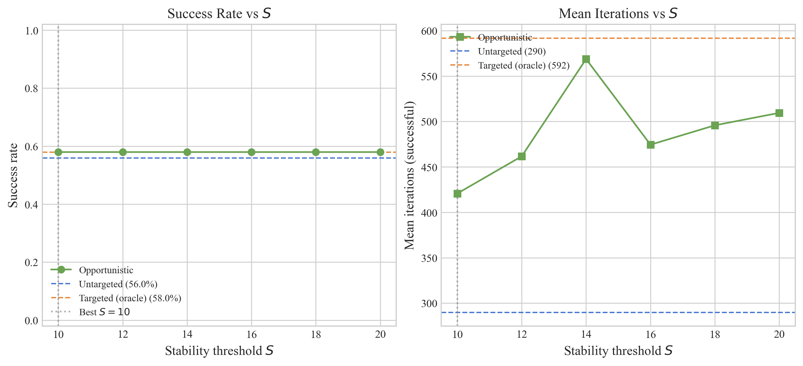
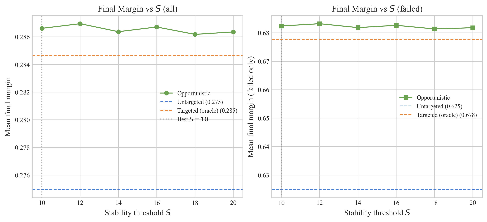

# Opportunistic Targeting: A Rank-Stability Heuristic for Query-Efficient Black-Box Adversarial Attacks

---

## Abstract

Black-box adversarial attacks that minimize only the ground-truth confidence suffer from *latent-space drift*: perturbations wander through the feature space without committing to a specific adversarial class, wasting queries on diffuse, undirected progress. We introduce **Opportunistic Targeting (OT)**, a lightweight wrapper that monitors the rank stability of the leading non-true class during an untargeted attack and dynamically switches to a targeted objective once a stable candidate emerges. OT requires no architectural modification to the underlying attack, no gradient access, and no *a priori* target-class knowledge.

We validate OT on two representative score-based attacks, SimBA and Square Attack (cross-entropy loss), across four standard ImageNet classifiers. OT consistently matches the performance of an oracle that knows the optimal target class in advance, while substantially outperforming untargeted baselines. Benefits scale with model depth (up to 64% query reduction on ResNet-50) and are confirmed on a 100-image benchmark with bootstrapped confidence intervals: OT closes the gap between untargeted and oracle success rates across the full query-budget range.

On adversarially-trained models, we observe a surprising inversion: both oracle-targeted and opportunistic attacks underperform untargeted baselines in query efficiency and final margin. This is not a failure of target selection but a fundamental property of robust loss landscapes, where targeting's directional commitment outweighs its benefits. A 50-image ablation confirms this holds across all tested stability thresholds.

---

## 1. Introduction

Standard untargeted black-box attacks operate by minimizing the model's confidence in the ground-truth class. This strategy, whether implemented as probability minimization in SimBA (Guo et al., 2019) or cross-entropy loss in Square Attack (Andriushchenko et al., 2020), treats all non-true classes as interchangeable. As the ground-truth confidence decreases, the freed probability mass spreads across the remaining classes without directional commitment. The adversarial perturbation effectively executes a random walk through the latent space, crossing class basins opportunistically rather than heading toward a specific decision boundary.

This *latent-space drift* directly impacts query efficiency. Each query spent exploring a class basin that will ultimately be abandoned is a wasted query. The deeper the model (and hence the higher-dimensional the feature space), the more basins the perturbation must traverse before settling, and the more pronounced the waste becomes. On a 50-layer residual network, an untargeted attack may require twice the queries needed to cross the *same* decision boundary that a targeted attack reaches directly.

Targeted attacks eliminate drift by construction: they push toward a fixed adversarial class from the first query. However, they require the attacker to specify a target class *a priori*, which is generally unavailable in a black-box setting. Choosing a suboptimal target can be worse than having no target at all, because the attack commits its entire budget to reaching a potentially distant or infeasible class.

Margin-based losses (Carlini and Wagner, 2017) offer a partial solution. By optimizing the gap between the ground-truth logit and the highest non-true logit, they implicitly track the nearest decision boundary at every iteration. The Square Attack paper's default loss is of this form, and it provides strong untargeted performance precisely because it encodes dynamic target selection into the loss function itself. However, not all attacks support margin losses. SimBA operates on raw probabilities; other attacks may use cross-entropy for compatibility or simplicity. For these methods, drift remains the main efficiency bottleneck.

**Opportunistic Targeting** bridges this gap. The key insight is that the information needed to select a good target class is already present in the attack's own trajectory: the class that an untargeted perturbation is naturally drifting toward is, by definition, the class whose decision boundary is most accessible. OT formalizes this observation through a rank-stability heuristic:

1. **Exploration phase.** The attack runs in standard untargeted mode. After each *accepted* perturbation (a step that improved the adversarial loss), we record which non-true class currently holds the highest predicted confidence.

2. **Stability check.** If the same class holds the top rank for $S$ consecutive accepted perturbations (the *stability threshold*), we declare it the opportunistic target.

3. **Exploitation phase.** The attack switches to a pure targeted objective against the locked class and runs until misclassification or budget exhaustion.

The stability threshold $S$ acts as a debouncing filter: it prevents the attack from locking onto volatile classes that spike due to random noise in early iterations, while remaining small enough that the exploration phase consumes a negligible fraction of the query budget.

This paper makes three contributions:

1. **A general-purpose wrapper** that adds opportunistic targeting to any score-based black-box attack, requiring only access to the predicted class distribution (not gradients or logits).

2. **Empirical validation** on standard ImageNet classifiers showing that OT provides near-oracle efficiency with zero *a priori* target knowledge, with benefits that scale predictably with model depth.

3. **A characterization of OT's failure mode** on adversarially-trained models, where flat confidence landscapes produce semantically plausible decoy targets that mislead the stability heuristic.

The remainder of this paper is organized as follows. Section 2 surveys related work on query-efficient black-box attacks. Section 3 describes the OT algorithm and its integration with SimBA and Square Attack. Section 4 details the experimental setup. Section 5 presents results on standard networks. Section 6 formalizes the connection between OT and margin-based losses. Section 7 reports ablation studies on the stability threshold and loss function. Section 8 extends the analysis to adversarially-trained models. Section 9 concludes.

---

## 2. Related Work

### 2.1 Score-Based Black-Box Attacks

Score-based (decision-score) attacks assume access to the full output probability vector but not to gradients. SimBA (Guo et al., 2019) iterates over an orthonormal basis (pixel or DCT), accepting perturbations that reduce the true-class probability. It requires only 1.4–1.5 queries per iteration on average and achieves high success rates on standard models. While SimBA could in principle adopt a margin-based acceptance criterion, its original formulation uses only the true-class probability, providing no mechanism for directing perturbations toward a specific adversarial class.

Square Attack (Andriushchenko et al., 2020) uses random square-shaped patches at the vertices of the $L_\infty$ ball, with a schedule that shrinks the patch size as the attack progresses. Its default margin loss $f_{y}(x) - \max_{k \neq y} f_k(x)$ implicitly tracks the nearest decision boundary. When run with cross-entropy loss instead, the margin guidance vanishes and the attack exhibits the same drift behavior as SimBA, making it an ideal testbed for isolating OT's contribution.

### 2.2 Decision-Based and Transfer Attacks

Decision-based attacks require only the top-1 label, not the full score vector. Recent work in this space focuses on geometric constructions: SurFree (Maho et al., 2021) uses random 2-D hyperplane search, and Gesny et al. (2024) show theoretically that reintroducing gradient estimation into SurFree (yielding CGBA) accelerates convergence of the angle $\theta(i)$ between the current perturbation direction and the optimal adversarial direction. This is structurally analogous to OT: where CGBA reintroduces directional information (gradient) into a blind geometric process, OT reintroduces directional information (target locking) into a blind score-based process. We formalize this parallel in Section 6.3 using the same angular convergence framework.

### 2.3 Attacks on Robust Models

Adversarially-trained models (Madry et al., 2018; Salman et al., 2020) present a qualitatively different challenge. Their flatter loss landscapes and more uniform confidence distributions mean that early-iteration class rankings are less informative. The robust-model experiments in Section 8 examine whether OT's rank-stability signal remains useful in this regime.

---

## 3. Method

### 3.1 Notation

Let $f: \mathcal{X} \to \mathbb{R}^K$ denote a classifier mapping inputs to logits over $K$ classes, and $P(k|x) = \text{softmax}(f(x))_k$ the predicted probability of class $k$. Given a correctly-classified input $x$ with true label $y$, the attacker seeks an adversarial example $x' = x + \delta$ such that $\arg\max_k P(k|x') \neq y$ and $\|\delta\|_\infty \leq \epsilon$.

### 3.2 Untargeted Loss and the Drift Problem

Standard untargeted attacks minimize a loss that depends only on the true class:

$$\mathcal{L}_{\text{untargeted}}(x', y) = P(y | x') \quad \text{(SimBA)} \qquad \text{or} \qquad \mathcal{L}_{\text{untargeted}}(x', y) = -\log P(y | x') \quad \text{(CE)}$$

These objectives decrease $P(y|x')$ without specifying where the freed probability mass should concentrate. In a $K$-class problem, the perturbation may distribute mass across hundreds of classes, crossing multiple class basins before any single competitor class exceeds the declining true-class confidence. We call this *latent-space drift*.

**Margin loss** avoids drift by construction:

$$\mathcal{L}_{\text{margin}}(x', y) = f_y(x') - \max_{k \neq y} f_k(x')$$

where $f_k(x')$ denotes the logit (pre-softmax score) for class $k$. The $\max_{k \neq y} f_k(x')$ term dynamically identifies the nearest competitor, providing implicit directionality at every iteration. Square Attack's default loss is of this form, explaining its strong untargeted performance.

### 3.3 Targeted Loss

A targeted attack toward class $t$ optimizes:

$$\mathcal{L}_{\text{targeted}}(x', t) = -P(t | x') \quad \text{(SimBA)} \qquad \text{or} \qquad \mathcal{L}_{\text{targeted}}(x', t) = \log P(t | x') \quad \text{(CE)}$$

Targeting eliminates drift but requires knowing $t$ in advance. An *oracle* target, i.e. the class that the unconstrained untargeted attack eventually reaches, provides an upper bound on targeted performance that no real attacker can achieve.

### 3.4 Opportunistic Targeting Algorithm

OT discovers the target class online by monitoring which adversarial class the perturbation is naturally drifting toward. The algorithm wraps any score-based attack without modifying its perturbation mechanism.

#### Algorithm 1: Opportunistic Targeting Wrapper

```text
Input: image x, true label y, attack A, stability threshold S
Output: adversarial example x'

1.  Initialize: x' ← x, locked ← False, target ← None, buffer ← circular buffer of size S
2.  while not misclassified(x') and budget not exhausted:
3.      mode ← targeted if locked else untargeted
4.      x' ← A.step(x', y if not locked else target, mode)
5.      if step was accepted:                          // loss improved
6.          c ← argmax_{k ≠ y} P(k | x')              // leading non-true class
7.          if not locked:
8.              buffer.append(c)
9.              if len(buffer) = S and all entries in buffer are identical:
10.                 target ← c
11.                 locked ← True
12. return x'
```

**Key design choices:**

- **Accepted perturbations only (line 5).** The stability counter increments only when the attack makes progress (reduces the loss). Rejected steps, which contribute no useful signal about the loss landscape, are ignored. This filters out noise from random, unproductive queries.

- **Consecutive stability (line 9).** The buffer must contain $S$ identical entries *in a row*. A single interruption resets the count. This strict debouncing prevents premature lock-in on volatile classes.

- **Irreversible lock (line 10–11).** Once a target is locked, the attack commits for the remainder of the budget. Releasing the lock would re-introduce the exploration overhead that OT is designed to eliminate.

### 3.5 Integration with SimBA

SimBA (Guo et al., 2019) perturbs the image along randomly-sampled orthonormal directions (pixel or DCT basis), accepting steps that improve the adversarial loss. Our implementation uses the DCT basis with 8×8 blocks, operating in $L_\infty$ with $\epsilon = 8/255$.

| Parameter | Value | Description |
| ----------- | ------- | ------------- |
| Basis | DCT (8×8 blocks) | Low-frequency directions; ~98% are descending |
| Step size | $\epsilon = 8/255$ | $L_\infty$ perturbation bound |
| Budget | 10,000 queries | Per-image query limit |
| Acceptance | $P(y\|x') < P(y\|x)$ (untargeted) | Greedy coordinate descent |

In untargeted mode, SimBA's acceptance criterion reduces $P(y|x')$, a single-class objective that, unlike margin loss, does not track the nearest competitor. Upon lock-in, the criterion switches to increasing $P(t|x')$ where $t$ is the locked target. The perturbation mechanism (basis selection, step size, acceptance rule) is unchanged; only the objective updates.

### 3.6 Integration with Square Attack (Cross-Entropy Loss)

Square Attack (Andriushchenko et al., 2020) samples random square patches at the vertices of the $L_\infty$ ball, with a patch size that decays according to a budget-dependent schedule. The schedule halves the patch fraction $p$ at iterations $\{10, 50, 200, 1000, 2000, 4000, 6000, 8000\}$ (for a 10,000-iteration budget), rescaling proportionally for other budgets.

**Important methodological note.** The patch schedule depends on the *total* budget $N$, not just the current iteration $i$. The `torchattacks` implementation normalizes via $\hat{i} = \lfloor i / N \times 10000 \rfloor$. This means iteration counts obtained under different budgets are **not comparable**: an attack with $N = 10\text{K}$ at iteration 5 used larger patches than one with $N = 1\text{K}$ at iteration 5. All our experiments use a fixed $N = 10\text{K}$ for Square Attack.

We run Square Attack with **cross-entropy loss** ($-\log P(y|x')$) rather than the default margin loss. This is a deliberate ablation: margin loss already provides implicit target tracking (Section 3.2), which would confound OT's contribution. With CE loss, the untargeted attack exhibits clear drift, and any efficiency gain can be attributed to OT.

| Parameter | Value | Description |
| ----------- | ------- | ------------- |
| Patch shape | Square, $L_\infty$ vertices | $\pm \epsilon$ per pixel |
| Loss | Cross-entropy | Drift-prone; no implicit targeting |
| Budget | $N = 10{,}000$ | Fixed for schedule comparability |
| $p$ schedule | Halved at $\{10, 50, 200, \ldots, 8000\}$ | Patch fraction decay |

---

## 4. Experimental Setup

### 4.1 Models

We evaluate on two model families:

**Standard (non-robust) ImageNet classifiers** from torchvision, wrapped with a `NormalizedModel` that applies ImageNet normalization internally so all attacks operate in $[0, 1]$ pixel space:

| Model | Depth | Parameters | Top-1 Accuracy |
| ------- | ------- | ----------- | ---------------- |
| AlexNet | 8 layers | 61M | 56.5% |
| ResNet-18 | 18 layers | 11.7M | 69.8% |
| VGG-16 | 16 layers | 138M | 71.6% |
| ResNet-50 | 50 layers | 25.6M | 76.1% |

**Adversarially-trained ImageNet classifiers** from RobustBench (Salman et al., 2020), with built-in normalization:

| Model | Architecture | Training |
| ------- | ------------- | ---------- |
| Salman2020Do\_R18 | ResNet-18 | PGD adversarial training |
| Salman2020Do\_R50 | ResNet-50 | PGD adversarial training |

### 4.2 Protocol

Each (model, attack, image) triplet is evaluated in three modes:

| Mode | Description |
| ------ | ------------- |
| **Untargeted** | Standard attack with no directional guidance. |
| **Targeted (oracle)** | Upper bound: target class chosen *a posteriori* from the untargeted result. |
| **Opportunistic** | Our method: lock onto the leading non-true class once rank-stability threshold $S$ is reached. |

The oracle target is the class that the untargeted attack converges to (i.e., the final predicted class after misclassification). This represents an upper bound on targeted performance: the oracle runs a targeted attack toward the class that is empirically most accessible for that specific image, which no real attacker could know *a priori*. Note that this oracle represents the best target *for that particular attack trajectory*, not necessarily the globally optimal target across all possible perturbation paths.

### 4.3 Configuration

- **Perturbation budget:** $\epsilon = 8/255 \approx 0.031$ in $[0, 1]$ pixel space ($L_\infty$ norm). This is the standard ImageNet adversarial benchmark setting.
- **Query budget:** 10,000 iterations for both attacks (4-image benchmark) and 15,000 iterations (100-image winrate benchmark).
- **Seeds:** Three random seeds (0, 1, 2) for the 4-image benchmark; single seed for the 100-image benchmark.
- **Stability threshold:** $S = 5$ for standard models, $S = 10$ for robust models.

### 4.4 Images

**4-image benchmark:** Four manually-selected ImageNet-compatible images (`corgi.jpg`, `porsche.jpg`, `dumbbell.jpg`, `hammer.jpg`). We filter (model, method, image) triplets where all three modes failed across all seeds, as these represent fundamentally infeasible attacks. This removes 2 configurations (SimBA on AlexNet for corgi and porsche), yielding 270 runs (90 per mode).

**100-image benchmark:** 100 images sampled from the ILSVRC2012 validation set (seed 42), selected to be correctly classified by ResNet-50. Each (method, image, mode) combination runs once at a fixed 15K budget.

### 4.5 Metrics

On standard networks where most attacks succeed, the primary metric is **iterations to success** (lower is better). Following Ughi et al. (2021), we also report **success rate as a function of query budget** (CDF curves), which captures the full distribution of attack difficulty rather than reducing it to a single threshold. On robust networks where most attacks fail, we report **final margin** $= \max(P(y_{\text{true}}) - \max_{k \neq y} P(k), 0)$ (lower is better, closer to the decision boundary).

### 4.6 Budget Censoring

All iteration counts are right-censored at the query budget. Failed runs that hit the ceiling represent a *lower bound* on the true cost. This censoring biases *against* OT's reported savings: the true untargeted cost for hard cases may be 2 to 10 times higher, making our savings estimates conservative.

---

## 5. Results on Standard Networks

### 5.1 Success Rates

OT matches oracle-targeted success rates for both attacks: 100% for SimBA (vs. 88.1% untargeted) and 100% for Square Attack (vs. 100% untargeted). SimBA's untargeted mode fails on ~12% of configurations (hard cases on deeper models), while OT rescues all of them.

### 5.2 CDF: Success Rate vs. Query Budget

The 100-image CDF benchmark on ResNet-50 (15K budget, 1000-sample percentile bootstrap, 90% CI bands) confirms these findings at scale.


**Figure 1: SimBA success rate vs. query budget** (ResNet-50, 100 images). OT (green) matches oracle-targeted performance (orange) exactly at 85%, a +32 percentage point gain over untargeted (53%). The curves overlap almost entirely, confirming that OT recovers oracle-level efficiency without knowing the target class.


**Figure 2: Square Attack (CE) success rate vs. query budget** (ResNet-50, 100 images). OT reaches 98% success, matching oracle (99%) and far exceeding untargeted (85%). The OT and oracle curves are nearly indistinguishable across the full budget range.

### 5.3 Mean Iterations to Success


**Figure 3: Mean iterations by attack mode** across all successful runs (270 total runs: 4 images × 3 seeds × 4 models × 2 attacks × 3 modes, filtered to exclude 2 configurations where all modes failed). Error bars show 95% bootstrap CI.

For SimBA, OT reduces mean iterations by 14.3%, landing within 2% of the oracle. For Square Attack (CE loss), the reduction is 48.3%. The Square Attack numbers are dominated by ResNet-50 (Section 5.4), where drift is most severe.


**Figure 4: Query distribution** (log scale). Untargeted (blue) vs. Opportunistic (red). Dashed lines show medians.

Median query counts tell the same story: SimBA drops from 5,865 (untargeted) to 4,706 (OT); Square Attack from 292 to 280. The distribution for Square Attack is bimodal: most runs converge quickly (~1–500 queries), with a long tail of hard cases in the thousands. OT primarily cuts this long tail.

### 5.4 The Depth-Scaling Hypothesis


**Figure 5: Iterations by model and mode.** OT's benefit scales with model depth: largest on ResNet-50, negligible on AlexNet.

On ResNet-50, savings reach 36.6% for SimBA and 64.0% for Square Attack. On shallower models (VGG-16, ResNet-18, AlexNet), savings range from negligible to ~22%, with VGG-16 + Square Attack showing a slight regression (−6.8%). Note that SimBA on ResNet-50 untargeted succeeds on only 7/12 runs (5 hit the 10K ceiling), so 36.6% is a conservative lower bound; OT achieves 12/12 success.

The largest gains appear on ResNet-50. We hypothesize this follows from latent space dimensionality: a 50-layer residual network maps inputs into a far higher-dimensional feature space than an 8-layer AlexNet. In this higher-dimensional space, untargeted perturbations experience more class drift, wandering through multiple adversarial class basins before settling. OT detects the emerging basin early and locks onto it, eliminating the drift phase.


**Figure 6: Opportunistic savings vs. attack difficulty.** Each point is one (model, method, image, seed) run. Dashed line: linear trend ($r = 0.38$, $p < 0.001$).

The difficulty–savings scatter plot supports this hypothesis: there is a statistically significant positive correlation between untargeted difficulty and OT's benefit. The harder the attack, the more OT helps.

### 5.5 Lock-in Dynamics


**Figure 7: Lock-in dynamics.** Faded curves show untargeted; vivid curves show opportunistic. Vertical dotted lines mark lock-in and convergence iterations.

The confidence traces illustrate why OT works.

**Square Attack on ResNet-50 (hammer.jpg).** Lock-in at iteration 31. OT converges at 2,126 vs. untargeted at 5,621 (62.2% savings). The untargeted trace shows ground-truth confidence declining slowly with the max-other-class confidence near zero. The perturbation spreads probability mass across many classes without committing. OT locks onto class 677 at iteration 31 and drives it upward monotonically, crossing the decision boundary at iteration 2,126.

**SimBA on ResNet-50 (corgi.jpg).** Lock-in at iteration 7 (essentially immediate). OT converges at 3,958 vs. untargeted at 7,075 (44.1% savings). SimBA's greedy coordinate-descent steps produce more consistent class rankings, enabling near-instant lock-in.

Lock-in occurs early: SimBA switches at a mean of 7.0 iterations (median 7, range 6–10), while Square Attack switches at 141.9 (median 113, range 11–542). 88.5% of all opportunistic runs (79/90) trigger the lock-in, and the exploration phase consumes less than 2% of the budget in all cases.

**Lock-match rate.** Does OT find the "right" target, i.e. the class that the untargeted attack would eventually reach? SimBA locks the oracle class 83.8% of the time; Square Attack 78.4%.


**Figure 8: Lock-match rate by model.** SimBA consistently locks the oracle class; Square Attack is lower but still effective.

Mismatch does not imply failure, however. OT achieves 100% success rate even when locking a different class than untargeted. The heuristic does not need the "correct" class, it only needs *a viable* class.

---

## 6. Opportunistic Targeting as a Margin Surrogate

### 6.1 Equivalence Under Stable Rankings

We can formalize the relationship between OT and margin loss. Once OT locks onto target class $t$, the attack minimizes $-P(t|x')$. If $t = \arg\max_{k \neq y} P(k|x')$ (which holds at the moment of lock-in, by definition), then maximizing $P(t|x')$ is equivalent to maximizing $\max_{k \neq y} P(k|x')$, which is exactly the margin loss's competitor term.

More precisely, the margin loss decomposes as:

$$\mathcal{L}_{\text{margin}} = f_y(x') - \max_{k \neq y} f_k(x') = \underbrace{f_y(x')}_{\text{push down true class}} - \underbrace{f_t(x')}_{\text{push up competitor}}$$

where $t$ is dynamically reselected at each iteration. OT approximates this by fixing $t$ after the exploration phase. The approximation is tight when the locked class remains the strongest competitor throughout the attack, which the stability check is designed to ensure.

### 6.2 Empirical Confirmation: CE Loss Ablation

Square Attack with margin loss shows **no benefit** from OT: the margin loss already performs dynamic target tracking at every iteration. When we strip this guidance by switching to CE loss, the untargeted attack degrades to 865 mean iterations (vs. 430 for margin), and OT restores near-oracle performance (447 iterations). This confirms that OT functions as a structural surrogate for margin loss, providing the directionality that drift-prone losses lack. The full ablation is reported in Section 7.2.

### 6.3 Perturbation Alignment (Theta Convergence)

Our analysis here is inspired by the angular convergence framework of Gesny et al. (2024), who track the angle $\theta(i)$ between the current perturbation direction $u(i)$ and the optimal direction $n$ (the decision boundary normal) to characterize how reintroducing gradient information accelerates convergence in decision-based attacks. We adopt the same lens for score-based attacks: we track the cosine similarity between each attack's perturbation $\delta(i) = x'(i) - x$ and the oracle direction $\delta_{\text{oracle}}$ (the perturbation produced by a targeted attack toward the oracle class). If OT acts as a margin surrogate, its perturbation should align more rapidly with $\delta_{\text{oracle}}$ than the untargeted attack's perturbation, just as CGBA's perturbation aligns more rapidly with the boundary normal than SurFree's.


**Figure 9: Perturbation alignment with oracle direction.** Cosine similarity between attack perturbation $\delta(i)$ and the oracle direction $\delta_{\text{oracle}}$ (the perturbation produced by a targeted attack toward the oracle class). SimBA on ResNet-50, 100 images, 500-iteration budget. Shaded regions show $\pm 1$ standard deviation. The vertical dashed line marks the mean switch iteration.

The results confirm the margin-surrogate hypothesis. Untargeted perturbations drift quasi-orthogonally to the oracle direction, reaching a terminal cosine similarity of only $0.174 \pm 0.189$ (median $0.190$), corresponding to an angle $\theta \approx 80°$. Opportunistic perturbations, after switching at a mean iteration of $7.3$ (median $7$, range $6$–$15$), rapidly align with $\delta_{\text{oracle}}$, reaching a terminal similarity of $0.865 \pm 0.192$ (median $0.910$, $\theta \approx 30°$). The alignment gap of $0.692$ (50° in angular terms) demonstrates that OT actively redirects the perturbation toward the oracle basin, not just selecting the correct target class.

---

## 7. Ablations

### 7.1 Stability Threshold $S$

The stability threshold $S$ controls the tradeoff between exploration (low $S$: lock quickly, risk locking on noise) and exploitation (high $S$: lock cautiously, waste budget on undirected exploration). Crucially, the optimal $S$ is **method-dependent**: SimBA's greedy coordinate-descent steps stabilize class rankings almost immediately (median lock-in at iteration ~7), while Square Attack's stochastic patch placement produces more volatile early rankings. A threshold that is tight for SimBA may be premature for Square Attack, and vice versa.

We sweep $S \in \{2, 3, 5, 8, 10, 12, 15\}$ independently for both attacks on standard ResNet-50 (100 images, 15K budget), reporting success rate and mean iterations to success for each (method, $S$) pair.


**Figure 10: Stability threshold ablation.** Top row: SimBA, bottom row: Square Attack (CE). Left: success rate vs. $S$; right: mean iterations (successful runs) vs. $S$. Dotted lines mark the optimal $S$.

**SimBA** ($S \in \{2, \ldots, 15\}$): Success rate is nearly flat, ranging from 84.0% ($S = 2$) to 85.1% ($S = 10$). Mean iterations are similarly stable ($4{,}814$–$4{,}956$). The optimal threshold is $S^*_{\text{SimBA}} = 10$, though the margin over neighboring values is slim. SimBA's greedy coordinate-descent steps produce stable early-iteration rankings, making the heuristic robust to $S$.

| $S$ | Success Rate | Mean Iters | Median Iters |
| ----- | ------------- | ----------- | ------------- |
| 2 | 84.0% | 4,860 | 4,108 |
| 3 | 84.2% | 4,814 | 3,905 |
| 5 | 85.0% | 4,952 | 4,286 |
| 8 | 85.1% | 4,915 | 4,144 |
| **10** | **85.1%** | **4,889** | **4,075** |
| 12 | 84.0% | 4,832 | 4,143 |
| 15 | 85.0% | 4,956 | 4,366 |

**Square Attack (CE)** ($S \in \{2, \ldots, 15\}$): The success rate peaks at $S = 8$ (98.1%) and drops slightly at lower and higher thresholds. Mean iterations show a clear valley at $S = 8$–$10$ ($1{,}719$–$1{,}780$), rising at both ends. The optimal threshold is $S^*_{\text{Square}} = 8$.

| $S$ | Success Rate | Mean Iters | Median Iters |
| ----- | ------------- | ----------- | ------------- |
| 2 | 97.1% | 1,917 | 779 |
| 3 | 97.1% | 1,929 | 774 |
| 5 | 97.1% | 2,004 | 754 |
| **8** | **98.1%** | **1,780** | **753** |
| 10 | 96.1% | 1,719 | 582 |
| 12 | 97.0% | 1,850 | 633 |
| 15 | 96.0% | 1,910 | 652 |

The optimal thresholds differ: $S^*_{\text{SimBA}} = 10$ vs. $S^*_{\text{Square}} = 8$. This confirms that the stability heuristic should be calibrated per attack. Square Attack's stochastic patch placement produces more volatile early rankings than SimBA's coordinate descent, yet it achieves peak performance at a *lower* $S$, likely because the larger per-step perturbations cause the correct target class to dominate earlier when it does stabilize.

### 7.2 Loss Function Ablation (Square Attack)

The CE-loss ablation on Square Attack isolates OT's contribution from the attack's native loss function (4-image benchmark, mean across all successful runs):

| Configuration | Mean Iters | Success Rate | Notes |
| -------------- | ----------- | ------------- | ------- |
| Margin loss, untargeted | 430 | 100% | Implicit dynamic targeting via $\max_{k \neq y}$ |
| Margin loss + OT | 432 | 100% | No additional benefit; OT is redundant |
| CE loss, untargeted | 865 | 100% | Drift: 2× the queries of margin |
| CE loss + OT | 447 | 100% | Restores near-margin performance |
| CE loss, oracle targeted | 430 | 100% | Upper bound |

Margin loss provides built-in target tracking that makes OT unnecessary. CE loss lacks this tracking, resulting in drift. OT compensates for the missing margin term, restoring efficiency to within 4% of the oracle. This confirms OT as a **general-purpose margin surrogate** applicable to any drift-prone loss.

---

## 8. Robust Models

### 8.1 Setup

We extend the evaluation to adversarially-trained ImageNet classifiers from RobustBench (Salman et al., 2020). The protocol mirrors the standard benchmark with two modifications:

1. **Stability threshold $S = 10$** (doubled from 5) to account for robust models' flatter confidence landscapes, which produce more volatile early-iteration class rankings.

2. **Metric: final margin** instead of iteration count. On standard networks, most attacks succeed and we compare speed. On robust networks, most attacks fail (overall success rate: 12.5–37.5%), so iteration counts are uninformative. Instead, we report the final margin $= \max(P(y_{\text{true}}) - \max_{k \neq y} P(k), 0)$, where lower is better (closer to misclassification).

The query budget of 10,000 matches the standard benchmark for comparability. This is likely insufficient for robust models; the Square Attack paper recommends 20,000 queries with random restarts for robust evaluation. We use 10K for the 4-image benchmark to maintain protocol consistency, but extend to 20K for the 50-image stability ablation (Section 8.4) where computational budget permits. The low absolute success rates in Section 8.2 should be interpreted with the 10K budget limitation in mind.

### 8.2 Margin Analysis and the Decoy Hypothesis

**Success rates:**

| Model | Method | Untargeted | Oracle | OT |
| ------- | -------- | ----------- | -------- | ----- |
| R18 | SimBA | 25.0% | 25.0% | 25.0% |
| R18 | Square Attack | 50.0% | 50.0% | 50.0% |
| R50 | SimBA | 0.0% | 0.0% | 0.0% |
| R50 | Square Attack | 25.0% | 25.0% | **0.0%** |

The final row is the critical finding: OT causes a success rate regression from 25% to 0% on R50 Square Attack.


**Figure 11: Final margin by model and mode on robust networks** (lower = better attack). Error bars show 95% CI across images and seeds.

**SimBA is mode-invariant on robust models.** Targeting mode has no measurable effect on margin or success rate. SimBA's coordinate-wise perturbations lack the power to exploit directional guidance against adversarial training.

**Square Attack shows mixed results.** On R18, OT matches oracle performance (margin 0.075 vs. 0.077). On R50, OT *underperforms* untargeted (0.267 vs. 0.221), and oracle-targeted achieves 0.188. This initially suggested the problem was target selection quality, but the 50-image ablation in Section 8.4 reveals a different story: even oracle-targeted attacks underperform untargeted when evaluated at scale.


**Figure 12: Lock-match rate on robust models.** On R50, OT never locks the oracle class (0% for both methods), explaining the performance regression. Dashed line shows the ~80% lock-match rate on standard models for comparison.

We term this failure mode the **decoy hypothesis**: on robust networks, adversarial training smooths the input loss landscape, creating an environment where multiple competing classes have similar early stability. OT locks onto a *semantically plausible* neighbor class that appears stable early but lies in a shallow adversarial basin:

| Image | True Class | OT Locks Onto | Peak Adversarial Class |
| ------- | ----------- | --------------- | ---------------------- |
| corgi.jpg | Pembroke (263) | Cardigan (264) | Dingo / Cardigan |
| dumbbell.jpg | Dumbbell (543) | Barbell (422) | Barbell (422) |
| hammer.jpg | Hammer (587) | Hatchet (596) | Hatchet / **Tripod (872)** |
| porsche.jpg | Sports car (817) | Racer (751) | Racer (751) |

The locked classes are not random: they are semantically related neighbors. For dumbbell and porsche, OT correctly identifies the peak adversarial class, but the attack still fails because even correctly-targeted perturbations cannot overcome the defense within budget. The critical failure is on hammer.jpg: OT locks onto hatchet (596), while the untargeted attack naturally drifts to tripod (872), a different, viable class. OT commits its budget to the wrong basin.

### 8.3 Interpreting the 4-Image Results

The 4-image benchmark suggests targeting helps on R18 but hurts on R50. However, the sample size (4 images × 3 seeds = 12 runs per mode) is too small to distinguish signal from noise. The R50 regression (25% untargeted → 0% OT, 1 fewer successful run out of 12) is not statistically significant (Fisher's exact test, $p = 0.48$). The 50-image ablation in Section 8.4 provides a clearer picture: on R50 at scale, both oracle-targeted and OT achieve 58% success vs. 56% untargeted (a +2 pp gain, not a regression), but at 45–104% higher query cost. The consistent finding across both benchmarks is that targeting mode has minimal impact on robust models, and when it does have an effect, it increases query cost rather than reducing it.

To determine whether OT's limited effectiveness on robust models is due to suboptimal stability-threshold tuning or a more fundamental issue, we conduct a comprehensive ablation study.

### 8.4 Stability Threshold Ablation on Robust Models

We sweep $S \in \{10, 12, 14, 16, 18, 20\}$ on Salman2020Do\_R50 with Square Attack (CE loss) across 50 correctly-classified images (20,000-iteration budget) to determine whether OT's underperformance on robust models can be mitigated by tuning the stability threshold.



**Figure 13: Robust model ablation** (Salman2020Do\_R50, 50 images, SquareAttack CE). Left: Success rate vs. $S$. Opportunistic (green) is flat at 58% across all $S$ values, matching oracle-targeted (orange, 58%) but exceeding untargeted (blue, 56%) by only 2 percentage points. Right: Mean iterations (successful runs only). Opportunistic ranges from 421–569 iterations depending on $S$, substantially higher than untargeted (290). Dotted line marks optimal $S = 10$.



**Figure 14: Final margin vs. $S$ (lower is better).** Left: All runs. Opportunistic achieves mean margin 0.287 (averaged across $S$), worse than both untargeted (0.275) and oracle-targeted (0.285). Right: Failed runs only. The margin gap persists: OT reaches 0.682, vs. untargeted 0.625 and oracle 0.678.

**Key finding: Targeting itself is counterproductive on robust models.** Across all tested $S$ values, opportunistic targeting achieves identical success rate (58%) to oracle-targeted attacks, confirming that OT successfully identifies viable target classes even on robust models. However, *both* targeted modes underperform untargeted in query efficiency: untargeted converges in a mean of 290 iterations, while opportunistic requires 421–569 iterations (45–96% more queries) and oracle-targeted requires 592 iterations (104% more queries). Similarly, untargeted achieves lower final margin (0.275 vs. 0.287 for OT), indicating it gets closer to the decision boundary on failed attacks.

The margin disadvantage persists when restricting to failed attacks only (Fig. 14, right): untargeted reaches 0.625, while OT and oracle-targeted reach 0.682 and 0.678 respectively. This rules out the hypothesis that the gap is driven by easy cases where all modes succeed trivially.

**Increasing $S$ does not rescue OT.** Success rate is perfectly flat at 58% for $S \in \{10, 20\}$. Mean iterations and final margin show minor variance with $S$ but no systematic trend. The optimal threshold ($S = 10$, the lowest tested value) achieves 421 mean iterations, still 45% worse than untargeted. This confirms that the problem is not premature lock-in or volatile early rankings—it is the strategic choice to target at all.

### 8.5 Why Targeting Fails on Robust Models

We hypothesize this inversion occurs because adversarial training fundamentally alters the geometry of the loss landscape. On standard models, the decision boundary between the true class and any single adversarial class forms a clear, accessible hyperplane. Targeting commits the attack's entire budget to crossing this boundary, eliminating drift and achieving query efficiency. On robust models, adversarial training smooths the landscape, creating multiple shallow adversarial basins with similar accessibility. An untargeted attack retains the flexibility to drift toward whichever basin becomes accessible as the perturbation evolves. A targeted attack commits to a single basin early, forfeiting this exploration flexibility. Even when the initial target is viable (as evidenced by 58% oracle success), the cost of commitment outweighs the benefit of directionality.

This suggests that on robust models, the optimal strategy is not *better* targeting (via improved target selection heuristics or higher $S$) but *no* targeting. Margin-based losses, which implicitly track the nearest competitor at every iteration without committing, may be the correct approach for robust evaluation, though this requires further investigation.

---

## 9. Discussion and Conclusion

### 9.1 Summary of Contributions

We introduced Opportunistic Targeting, a wrapper that adds dynamic target selection to any score-based black-box adversarial attack. The key findings are:

1. **Near-oracle efficiency with zero prior knowledge.** On standard ImageNet classifiers, OT lands within 2–4% of an oracle that knows the optimal target class in advance, reducing mean queries by 14% (SimBA) and 48% (Square Attack, CE loss).

2. **Difficulty-scaled benefits.** OT's savings correlate positively with attack difficulty ($r = 0.38$, $p < 0.001$). On ResNet-50, the deepest and hardest-to-attack model, savings reach 37% (SimBA) and 64% (Square Attack).

3. **Failure rescue.** OT converts SimBA's 88% untargeted success rate to 100%, matching the oracle. Under a fixed query budget, OT expands the set of feasible attacks, not just their speed.

4. **Structural equivalence to margin loss.** The CE-loss ablation on Square Attack confirms that OT functions as a structural surrogate for margin-based losses. When the loss already provides implicit target tracking (margin loss), OT is redundant. When it does not (CE loss, SimBA), OT restores near-optimal directionality.

5. **Targeting inversion on robust networks.** On adversarially-trained models, both oracle-targeted and opportunistic attacks underperform untargeted baselines in query efficiency and final margin. This is not a failure of OT's target selection (OT matches oracle success rate) but a fundamental property of robust landscapes: targeting commits to a single adversarial basin early, forfeiting the exploration flexibility that allows untargeted attacks to drift toward whichever basin becomes accessible. A 50-image ablation confirms this holds across all tested stability thresholds ($S \in \{10, 20\}$).

### 9.2 Limitations

**Sample size.** The 4-image benchmark per model, while sufficient to establish the main findings, produces wide confidence intervals at per-model granularity. The 100-image CDF benchmark on ResNet-50 provides tighter estimates for that model but does not extend to multi-model comparisons.

The 100-image CDF benchmark on ResNet-50 narrows the confidence intervals substantially. At 15K budget: SimBA OT matches oracle at 85% (vs. 53% untargeted); Square Attack OT reaches 98% (vs. 85% untargeted, 99% oracle). These results confirm the 4-image findings are not artifacts of small sample size.

**Budget censoring.** Untargeted iteration counts are right-censored at 10,000 (or 15,000 for the winrate benchmark). The true cost of hard attacks is higher, making our savings estimates conservative lower bounds.

**VGG-16 anomaly.** VGG-16 + Square Attack shows a slight mean regression (−6.8%) with OT. VGG-16's lack of skip connections may produce a less structured latent landscape where early rank signals are less predictive. This is a genuine limitation: OT is not universally beneficial on all architectures at low query counts.

**Robust model scope.** Two adversarially-trained models were tested (Salman2020Do\_R18, Salman2020Do\_R50), with a 4-image benchmark and a 50-image stability-threshold ablation on R50. The finding that targeting is counterproductive on robust models (Section 8.4-8.5) is consistent across both models, all tested $S$ values, and holds for both oracle-targeted and opportunistic modes. However, this result is specific to the Salman et al. (2020) $L_\infty$ adversarial training procedure. Other robust training methods (e.g., TRADES, MART, $L_2$ defenses) may exhibit different landscape properties. The hypothesis that robust landscapes favor exploration over directional commitment requires validation on additional defense types.

### 9.3 Future Directions

1. **Landscape-aware mode selection.** Since targeting is beneficial on standard models but harmful on robust models, a meta-heuristic that detects landscape type (e.g., via early-iteration confidence variance or margin flatness) and selects between OT and untargeted accordingly could unify both regimes. This would make OT a fully adaptive wrapper that self-configures based on the defense.

2. **Margin loss integration.** Our results suggest margin-based losses may be the optimal approach for robust models, as they track the nearest competitor dynamically without committing. Testing whether OT provides any benefit when *added on top of* margin loss (rather than replacing it) would clarify whether the two mechanisms are complementary or redundant.

3. **Extension to other robust training methods.** The targeting inversion holds for Salman et al. (2020) $L_\infty$ adversarial training, but other defenses (TRADES, MART, $L_2$ training, certified defenses) may exhibit different loss landscape geometries. Testing OT on diverse robust models would establish the scope of the inversion effect.

4. **Larger-scale evaluation on standard models.** Testing on the full ImageNet validation set (50K images), additional model families (Vision Transformers, EfficientNets, DenseNets), and non-ImageNet datasets (CIFAR-10, CIFAR-100) would establish OT's generality on standard models more conclusively.

### 9.4 Conclusion

Opportunistic Targeting demonstrates that the information needed to select an effective adversarial target is already latent in the attack's own trajectory. By monitoring rank stability and committing when a clear candidate emerges, OT eliminates the latent-space drift that plagues probability-minimization and cross-entropy losses, providing a simple, general-purpose bridge between undirected exploration and directed exploitation.

On standard models, the bridge is essentially free: every query in the exploration phase advances the attack as a normal untargeted step, and the stability monitor simply observes which direction the perturbation is naturally heading. Once a target emerges, the attack commits and achieves near-oracle efficiency. The simplicity of the approach (a stability counter and a mode switch, with no architectural or loss-function modifications) makes it immediately applicable to any score-based black-box attack operating on drift-prone losses.

Beyond demonstrating OT's effectiveness on standard models, this work reveals a surprising asymmetry in adversarial attack strategy: **adversarial training inverts the value of targeting**. On standard models, targeted attacks are strictly more efficient than untargeted for reaching the same final adversarial class. On robust models, targeting—even with oracle knowledge of the optimal class—degrades both query efficiency and final margin relative to untargeted baselines. This is not a failure of OT's heuristic (OT successfully identifies viable targets and matches oracle success rates) but a fundamental property of robust loss landscapes. We hypothesize that adversarial training's landscape smoothing creates multiple shallow adversarial basins with similar accessibility, making exploration flexibility more valuable than directional commitment. This suggests that robust evaluation should favor margin-based losses (which track the nearest competitor dynamically without committing) or untargeted attacks, and that OT's appropriate role on robust models is as a diagnostic tool for understanding when targeting helps versus when it hinders.

---

## References

- Andriushchenko, M., Croce, F., Flammarion, N., and Hein, M. (2020). *Square Attack: A Query-Efficient Black-Box Adversarial Attack via Random Search*. ECCV.
- Carlini, N., and Wagner, D. (2017). *Towards Evaluating the Robustness of Neural Networks*. IEEE S&P.
- Gesny, E., Giboulot, E., and Furon, T. (2024). *When Does Gradient Estimation Improve Black-Box Adversarial Attacks?*. WIFS.
- Guo, C., Gardner, J. R., You, Y., Wilson, A. G., and Weinberger, K. Q. (2019). *Simple Black-box Adversarial Attacks*. ICML.
- Madry, A., Makelov, A., Schmidt, L., Tsipras, D., and Vladu, A. (2018). *Towards Deep Learning Models Resistant to Adversarial Attacks*. ICLR.
- Maho, T., Furon, T., and Le Merrer, E. (2021). *SurFree: A Fast Surrogate-Free Black-Box Attack*. CVPR.
- Salman, H., Ilyas, A., Engstrom, L., Kapoor, A., and Madry, A. (2020). *Do Adversarially Robust ImageNet Models Transfer Better?*. NeurIPS.
- Ughi, G., Abrol, V., and Tanner, J. (2021). *An Empirical Study of Derivative-Free-Optimization Algorithms for Targeted Black-Box Attacks in Deep Neural Networks*. Machine Learning.
